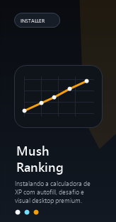

# Mush Ranking


[](#download)

Desktop app para acompanhar progressao, estimar vitorias e montar desafios de XP no Mush com autofill a partir da API publica.

---

## Visao geral

O Mush Ranking nasceu como uma calculadora de XP em desktop com foco em rapidez visual e leitura clara. O app consulta a API publica do Mush, identifica automaticamente o player pelo nick e preenche os dados principais para simular subida de level em modos como `Bedwars`, `Skywars` e `Duels`.

Hoje o projeto prioriza:

- autofill de perfil com dados vindos da API
- calculo de XP restante e vitorias estimadas
- desafio automatico para subida de level
- visual desktop moderno em `React + Tauri`
- build nativo para Windows com instalador `.exe`

---

## Preview

### App


### Instalador




---

## Recursos

- Busca automatica por nick
- Autofill de `level atual`, `XP atual` e `XP por vitoria`
- Suporte para `Double XP`
- Calculo de `XP ate o proximo level`
- Calculo de `XP restante ate o alvo`
- Estimativa de vitorias para subir
- Bloco de desafio com metas por dificuldade e periodo
- Hover do perfil com skin completa e stats do modo atual
- Instalador NSIS customizado com identidade visual propria

---

## Stack

- `React 19`
- `TypeScript`
- `Vite`
- `Tauri v2`
- `NSIS` para o instalador Windows

---

## Download

[](https://github.com/lucasaraujo-dev/mush-ranking/releases/tag/v0.1.0)

Instalador atual gerado pelo projeto:

```text
Mush Ranking_0.1.0_x64-setup.exe
```

---

## Estrutura

```text
src/
  components/
  features/
    xp-calculator/
  services/
  store/
  utils/

src-tauri/
  icons/
  installer-assets/
  tauri.conf.json
```

---

## API

O app usa a API publica do Mush:

- `GET /player/{nameOrUuid}`
- `GET /player/profileid/{profile_id}`
- `GET /games/{mode}/xptable`

Referencia:

- [API publica do Mush](https://mush.com.br/api)
- [Documentacao da API](https://forum.mush.com.br/topic/149525/documenta%C3%A7%C3%A3o-api-mush)

---

## Observacoes

- Alguns stats podem ter atraso dependendo da sincronizacao da API publica.
- Modos de `Duels` usam regras especificas de XP por vitoria conforme a logica definida no app.
- O instalador foi personalizado com assets proprios, mas a barra de progresso continua sendo a nativa do NSIS.

---

## Roadmap

- melhorar atualizacao em tempo real dos stats
- expandir regras oficiais de XP para mais modos e submodos
- adicionar mais visuais e telas de acompanhamento
- publicar releases versionadas

---

## Licenca

Projeto sem licenca definida no momento.
